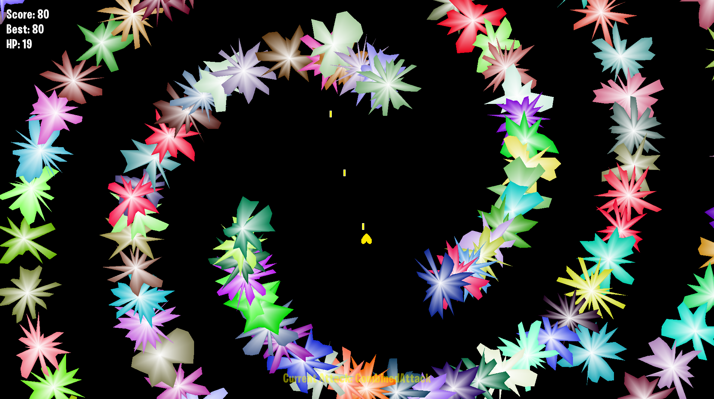

# Particles

a particle system and bullet hell game that was built using C++ and SFML. 
the bullet hell section is heavily inspired by Undertale/Deltarune



# Building
Note: First build will download and compile SFML 3.1.0 alongside
it's dependencies with can be a minimum of (~2GB).

## Build Instructions

### Windows
Start by running `build.bat` and open `Particles.sln` in the build folder.

### Linux

```bash

# Ensure that SFML is installed.
sudo apt-get install libsfml-dev

# Then Build
make

# and run
make run

```
## Credits

If you use or reference this project please provide credit.

## License

MIT License. see the LICENSE file for more info.
